# Informe Final — Proyecto IngeSoft V: CircleGuard

**Repositorio:** https://github.com/Electromayonaise/Circle-Guard-IngSoV  
**Cluster:** Azure Kubernetes Service (AKS) — `circleguard-dev-aks`, resource group `circleguard-dev-rg`  
**Registry:** `circleguarddevacr.azurecr.io`  
**Ambientes:** `dev` / `stage` / `master` (namespaces de Kubernetes)

---

## 1. Metodología Ágil y Estrategia de Branching (10%)

### 1.1. Implementar una metodología ágil (Scrum o Kanban) para el desarrollo del proyecto

Se adoptó **Kanban** como metodología ágil, gestionado a través de **GitHub Projects**. El tablero tiene tres columnas: `Backlog`, `In Progress` y `Done`. Cada tarjeta corresponde a un issue de GitHub con criterios de aceptación definidos. Las tareas del proyecto final (Terraform IaC, RBAC+TLS, JaCoCo+ZAP, Observabilidad, Change Management) aparecen completadas en `Done`.

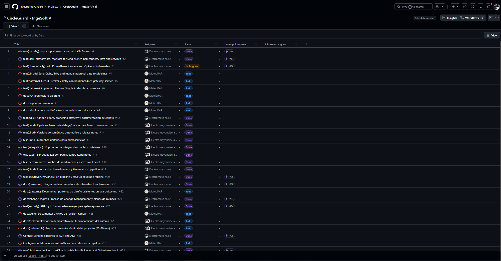

### 1.2. Definir y documentar una estrategia de branching (GitFlow, GitHub Flow o similar)

Se implementó un flujo inspirado en GitFlow con tres niveles de ramas, documentado en [docs/agile/branching-strategy.md](docs/agile/branching-strategy.md):

| Rama | Propósito | Pipeline asociado |
|------|-----------|-------------------|
| `main` | Código estable y taggeado. Cada merge dispara el pipeline de master con gates completos. | `Jenkinsfile.master` |
| `develop` | Rama de integración. Cada push dispara dev y stage en paralelo sobre el mismo commit. | `Jenkinsfile.dev` + `Jenkinsfile.stage` |
| `feature/<N>-<nombre>` | Una rama por issue. El número corresponde al issue de GitHub. | `Jenkinsfile.dev` |

```
feature/X  ──PR──▶  develop  ──PR──▶  main
                       │                 │
               Pipeline Dev          Pipeline Master
               Pipeline Stage        (producción)
```

Las ramas activas reflejan la estructura GitFlow: `main` (producción), `develop` (integración continua) y ramas `feature/N-nombre` por issue numerado según el tablero Kanban.

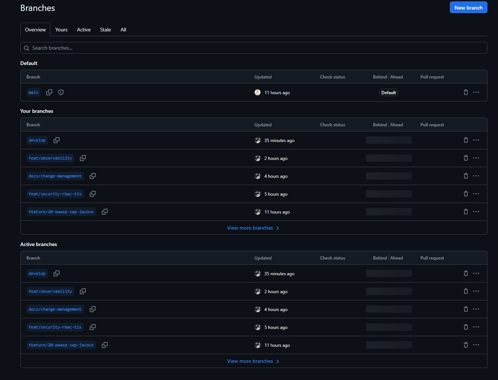

### 1.3. Utilizar un sistema de gestión de proyectos ágiles (Jira, Trello, GitHub Projects, etc.)

Se usa **GitHub Projects** integrado directamente al repositorio. Cada issue tiene criterios de aceptación, labels por tipo (feat/fix/chore) y se vincula a los PRs automáticamente. Ver tablero en la sección 1.1.

### 1.4. Documentar sprints, historias de usuario y criterios de aceptación

Cada issue en GitHub Projects actúa como historia de usuario con criterios de aceptación en el cuerpo. Los PRs mergeados vinculan el trabajo completado con el issue correspondiente, cerrándolo automáticamente mediante `closes #N` en el mensaje de merge.

Los PRs mergeados muestran la trazabilidad completa: título en Conventional Commits, descripción del cambio y referencia al issue de origen. Todos los PRs requieren al menos una aprobación y pipeline verde antes del merge.

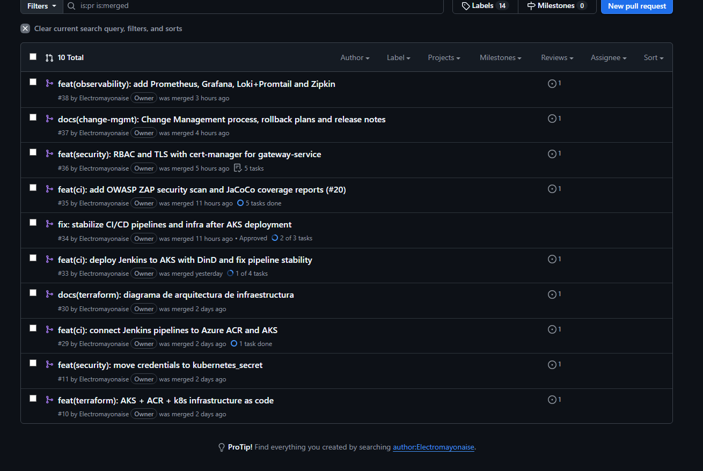

### 1.5. Realizar al menos 2 iteraciones completas durante el desarrollo

| Iteración | Alcance | PRs relevantes |
|-----------|---------|----------------|
| Taller 2 | 6 microservicios core, CI/CD Jenkins, pruebas unitarias/integración, 16 E2E, Locust, versionado semántico | PR #1–#32 |
| Proyecto Final | Terraform IaC completo, RBAC + TLS, OWASP ZAP + JaCoCo, Observabilidad (Prometheus/Grafana/Loki/Zipkin), dashboard-service y file-service integrados | [PR #33](https://github.com/Electromayonaise/Circle-Guard-IngSoV/pull/33), [PR #35](https://github.com/Electromayonaise/Circle-Guard-IngSoV/pull/35), [PR #36](https://github.com/Electromayonaise/Circle-Guard-IngSoV/pull/36), [PR #37](https://github.com/Electromayonaise/Circle-Guard-IngSoV/pull/37), [PR #38](https://github.com/Electromayonaise/Circle-Guard-IngSoV/pull/38) |

---

## 2. Infraestructura como Código con Terraform (20%)

### 2.1. Configurar toda la infraestructura necesaria usando Terraform

Toda la infraestructura está definida en Terraform ([terraform/](terraform/)). El `terraform apply` aprovisiona: cluster AKS con dos node pools (`default` Standard_B2s × 2 y `jenkins` Standard_D2s_v3 × 1), Azure Container Registry con role assignment `AcrPull`, namespaces de Kubernetes, PostgreSQL, Neo4j, Redis, Kafka, Secrets y ConfigMaps por namespace.

El resource group `circleguard-dev-rg` contiene todos los recursos provisionados: el cluster AKS, el ACR, los discos managed para los PVCs (PostgreSQL y Neo4j), las IPs públicas de los LoadBalancers y los NSGs.

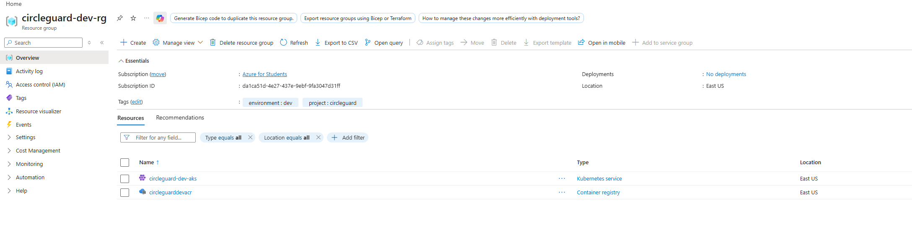

El cluster AKS `circleguard-dev-aks` muestra la versión de Kubernetes (1.34), la región (`eastus`), los node pools activos y el estado del control plane. Tiene habilitados OIDC Issuer y Workload Identity para integración segura con servicios de Azure. El node pool `jenkins` tiene el taint `dedicated=jenkins:NoSchedule` para aislar las cargas de CI/CD del resto de workloads.

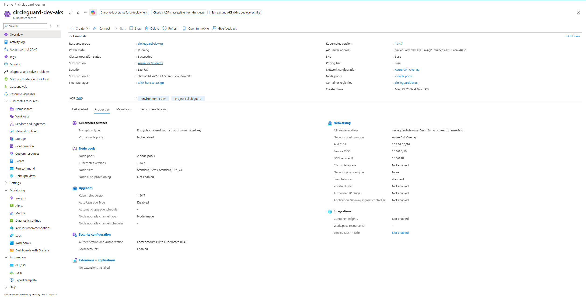

Los 8 microservicios en namespace `dev` aparecen en estado 1/1 Ready, junto con los componentes de infraestructura (Kafka, Neo4j, Redis, PostgreSQL), Jenkins en su nodo dedicado, cert-manager y el ingress-nginx-controller. Todos los workloads relevantes están en estado Ready.

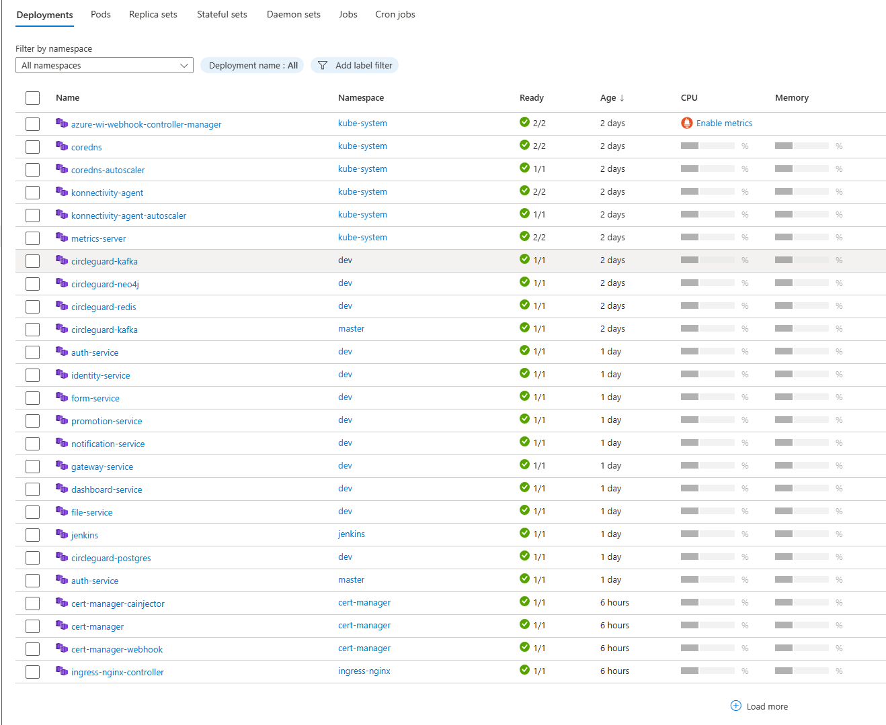

**Infraestructura por namespace** (módulo `k8s-infra`, instanciado una vez por ambiente):
- **PostgreSQL 16** con PVC 2Gi, init script para 5 bases de datos, estrategia `Recreate`
- **Neo4j 5** con PVC 1Gi, estrategia `Recreate` (evita store lock conflict)
- **Redis 7.2** — caché de sesión y estado QR
- **Apache Kafka 3.7.0** — mensajería asíncrona KRaft (sin ZooKeeper)

### 2.2. Implementar estructura modular

La estructura de módulos reutilizables permite parametrizar cada ambiente independientemente:

```
terraform/
├── main.tf                    ← orquesta todos los módulos
├── terraform.tf               ← backend remoto (Terraform Cloud)
├── variables.tf               ← variables globales
├── outputs.tf
├── environments/
│   ├── dev.tfvars             ← dev: 2 nodos Standard_B2s
│   ├── stage.tfvars
│   └── prod.tfvars
└── modules/
    ├── aks-cluster/           ← Cluster AKS + node pool Jenkins
    ├── acr/                   ← Azure Container Registry + role assignment
    ├── k8s-namespace/         ← Namespaces Kubernetes
    ├── k8s-infra/             ← PostgreSQL, Neo4j, Redis, Kafka, Secrets, ConfigMap
    └── k8s-service/           ← Deployment + Service por microservicio
```

El output de `terraform plan` lista todos los recursos gestionados. Los recursos que ya existen muestran "no changes", indicando convergencia entre el estado deseado en Terraform y el estado real en Azure.

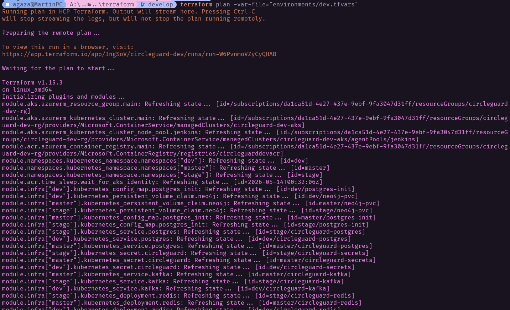

### 2.3. Implementar configuración para múltiples ambientes (dev, stage, prod)

Los tres ambientes (`dev`, `stage`, `master`) comparten el mismo cluster AKS. El aislamiento lo proveen los namespaces de Kubernetes. La parametrización por ambiente se maneja mediante `.tfvars` independientes:

| Variable | dev | stage | prod |
|----------|-----|-------|------|
| `vm_size` | `Standard_B2s` | `Standard_B2s` | ajustable |
| `node_count` | 2 | 2 | ajustable |
| `namespaces` | `["dev"]` | `["stage"]` | `["master"]` |

Los 11 namespaces activos en el cluster reflejan la separación completa: `dev`, `stage` y `master` para los tres ambientes de la aplicación; `jenkins` para CI/CD; `cert-manager` e `ingress-nginx` para seguridad TLS; y `monitoring` para observabilidad.

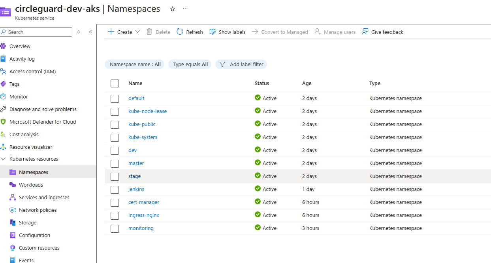

### 2.4. Documentar la arquitectura de infraestructura con diagramas

La arquitectura de infraestructura está completamente documentada en **[docs/diagrams/terraform-infrastructure.md](docs/diagrams/terraform-infrastructure.md)**, que incluye los diagramas Mermaid del grafo de dependencias entre módulos, los recursos de Azure y el stack de Kubernetes por namespace.

**Grafo de dependencias entre módulos Terraform:**

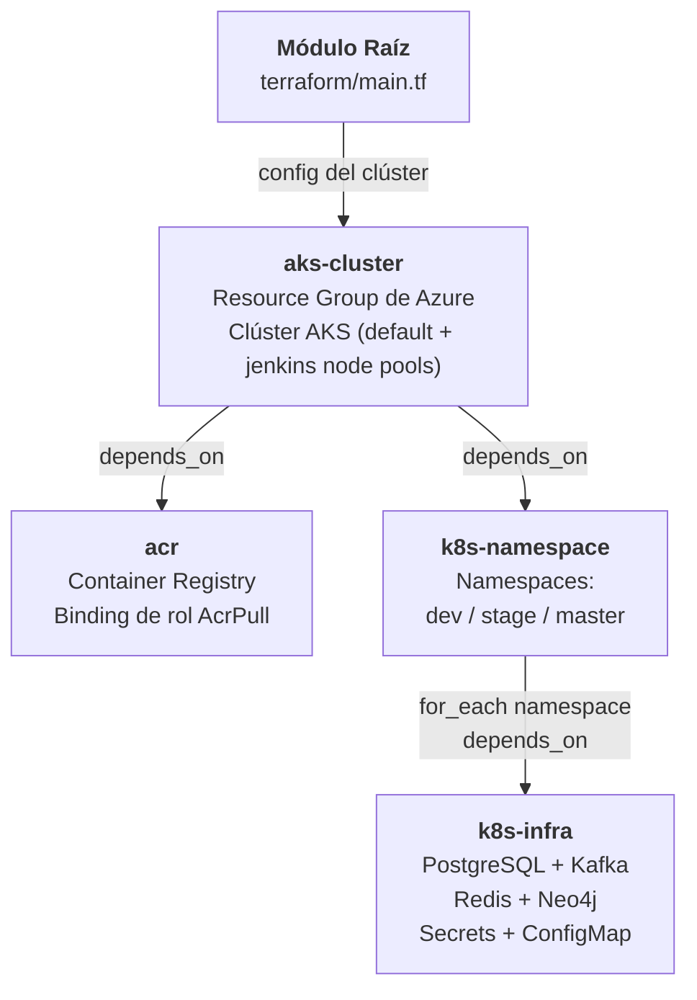
```mermaid
graph TD
    ROOT["<b>Módulo Raíz</b><br/>terraform/main.tf"]

    ROOT -->|"config del clúster"| AKS["<b>aks-cluster</b><br/>Resource Group de Azure<br/>Clúster AKS (default + jenkins node pools)"]
    AKS -->|"depends_on"| ACR["<b>acr</b><br/>Container Registry<br/>Binding de rol AcrPull"]
    AKS -->|"depends_on"| NS["<b>k8s-namespace</b><br/>Namespaces:<br/>dev / stage / master"]
    NS -->|"for_each namespace<br/>depends_on"| INFRA["<b>k8s-infra</b><br/>PostgreSQL + Kafka<br/>Redis + Neo4j<br/>Secrets + ConfigMap"]
```

Los microservicios **no** son gestionados por Terraform desde el módulo raíz — su despliegue es responsabilidad exclusiva de los pipelines de Jenkins, que construyen la imagen Docker, la publican en ACR y aplican el manifiesto Kubernetes de forma independiente al estado de Terraform.

**Diagramas pendientes** (asignados al otro integrante del equipo):

> _Pendiente — Diagrama C4 de la arquitectura de microservicios (Context, Containers, Components)._

> _Pendiente — Diagrama de despliegue en Kubernetes (pods, services, ingress, volúmenes)._

### 2.5. Implementar backend remoto para el estado de Terraform

El estado se almacena en **Terraform Cloud** (organización `IngSoV`), workspace `circleguard-dev`:

```hcl
terraform {
  cloud {
    organization = "IngSoV"
    workspaces { tags = ["circleguard"] }
  }
}
```

**Decisión de diseño — workspace único:** Se optó por un único workspace porque los tres ambientes comparten el mismo cluster AKS y el mismo ACR. El aislamiento entre ambientes lo provee Kubernetes mediante namespaces separados, no Terraform. Un workspace centraliza el estado de la infraestructura compartida y evita duplicar recursos de cómputo.

El workspace muestra el historial de ejecuciones (plan/apply), el estado de la última corrida y la versión del estado remoto. El estado se bloquea durante ejecuciones del pipeline para evitar concurrencia.

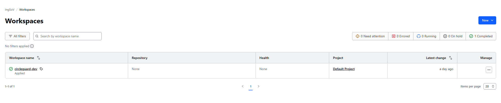

---

## 3. Patrones de Diseño (10%)

### 3.1. Identificar y documentar los patrones de diseño utilizados en la arquitectura existente

| Patrón | Ubicación en el código | Descripción |
|--------|----------------------|-------------|
| **Observer** | Kafka: `form-service` publica → `promotion-service` consume → `notification-service` consume | Desacoplamiento asíncrono de eventos de dominio |
| **Repository** | `IdentityRepository`, `SurveyRepository`, `QuestionnaireRepository` (Spring Data JPA) | Abstracción de acceso a datos por entidad |
| **DTO / Mapper** | `SymptomMapper`, `SurveyMapper`, paquetes `dto/` en cada servicio | Separación entre modelo de dominio y contratos de API |
| **Singleton** | Spring `@Bean`, `ApplicationContext` | Instancia única de componentes de infraestructura |
| **API Gateway** | `circleguard-gateway-service` — valida JWT, cachea estado QR en Redis | Punto de entrada único, cross-cutting concerns centralizados |

### 3.2. Implementar o mejorar al menos tres patrones adicionales

Se implementaron dos patrones adicionales (secciones 3.3 y 3.4). El patrón de resiliencia está asignado al compañero de equipo (ver 3.3).

### 3.3. Un patrón de resiliencia (Circuit Breaker, Bulkhead, etc.)

> _Pendiente — asignado al otro integrante del equipo. Se implementará con Resilience4j en el `gateway-service`._

### 3.4. Un patrón de configuración (External Configuration, Feature Toggle, etc.)

**External Configuration** — toda la configuración de los microservicios se externaliza hacia el ConfigMap de Kubernetes `circleguard-config`, sin valores hardcodeados en las imágenes Docker. Las 16 variables (hosts de BD, puertos, URLs, secrets, configuración de observabilidad) se inyectan vía `envFrom`:

```yaml
envFrom:
  - configMapRef:
      name: circleguard-config
  - secretRef:
      name: circleguard-secrets
```

**Beneficio:** Las imágenes Docker son inmutables y reutilizables entre ambientes; solo cambia la configuración inyectada por Kubernetes.

**Feature Toggle** — implementado en `dashboard-service` mediante la variable `ANALYTICS_ENABLED` en el ConfigMap. Si el valor es `false`, el `AnalyticsController` retorna HTTP 503 inmediatamente sin ejecutar la lógica de análisis, permitiendo desactivar features en caliente sin redeploy.

### 3.5. Documentar los patrones implementados, su propósito y beneficios

| Patrón | Propósito | Beneficio |
|--------|-----------|-----------|
| External Configuration | Externalizar toda configuración hacia Kubernetes ConfigMap/Secrets | Imágenes inmutables reutilizables entre ambientes; rotación de credenciales sin rebuild |
| Feature Toggle | Activar/desactivar analytics en `dashboard-service` sin redeploy | Despliegue continuo seguro; rollback instantáneo de features sin afectar el servicio |
| API Gateway | Centralizar JWT validation, QR cache en Redis, enrutamiento | Un solo punto de entrada; cross-cutting concerns centralizados fuera de los microservicios |

---

## 4. CI/CD Avanzado (15%)

### 4.1. Implementar pipelines completos de CI/CD (Jenkins, GitHub Actions o Azure DevOps)

CircleGuard tiene tres pipelines Jenkins independientes activados por webhook de GitHub:

| Pipeline | Archivo | Branch | Namespace | Stages principales |
|----------|---------|--------|-----------|-------------------|
| Dev | [Jenkinsfile.dev](Jenkinsfile.dev) | `feature/*` | `dev` | Checkout → Build → Unit Tests → Docker Build/Push → Deploy → Smoke Tests |
| Stage | [Jenkinsfile.stage](Jenkinsfile.stage) | `develop` | `stage` | Build → Unit Tests → Docker Build/Push → Deploy → Integration Tests → E2E → OWASP ZAP |
| Master | [Jenkinsfile.master](Jenkinsfile.master) | `main` | `master` | Build → Compute Version → Unit Tests (JaCoCo) → Docker Build/Push → Deploy → System Tests → OWASP ZAP → Locust → Release Notes → Tag |

_Jenkins disponible en: `http://48.202.171.66:8080`_

El pipeline dev muestra todos los stages en verde: Checkout → Build → Unit Tests → Docker Build/Push → Deploy a `dev` → Smoke Tests. El pipeline completo corre en menos de 10 minutos desde el push de la feature branch.

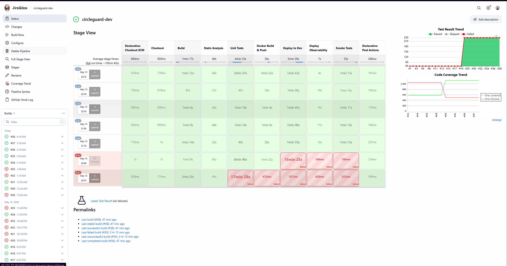

El build #50 del pipeline stage muestra 305 tests pasando, Integration Tests con Testcontainers, E2E en verde contra el cluster real y OWASP ZAP sin alertas críticas.

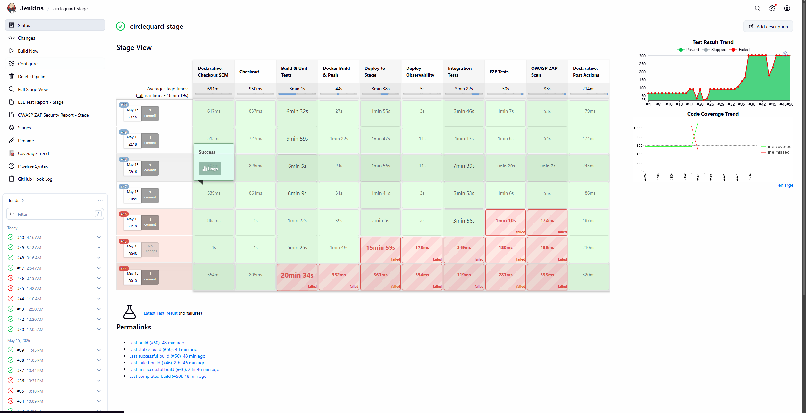

_Pipeline master: pendiente de ejecución tras el primer merge a `main`._


Jenkins corre como pod en el namespace `jenkins` del cluster AKS con node pool dedicado (`dedicated=jenkins:NoSchedule`), Docker-in-Docker (DinD) en modo TCP, y acceso a AKS vía Azure Service Principal. — [PR #33](https://github.com/Electromayonaise/Circle-Guard-IngSoV/pull/33)

### 4.2. Configurar ambientes separados (dev, stage, prod) con promoción controlada

La promoción entre ambientes sigue el flujo de ramas:
- **feature → develop**: dispara automáticamente los pipelines Dev y Stage en paralelo
- **develop → main**: requiere PR aprobado manualmente + pipeline Stage verde

Los tres namespaces (`dev`, `stage`, `master`) están activos en el cluster. Ver sección 2.3 para la imagen de namespaces.

### 4.3. Implementar SonarQube para análisis estático de código

> _Pendiente — asignado al otro integrante del equipo._

### 4.4. Implementar Trivy para escaneo de vulnerabilidades en contenedores

> _Pendiente — no implementado en el alcance actual._

### 4.5. Implementar versionado semántico automático

El stage `Compute Version` calcula la versión SemVer a partir de los commits desde el último tag:

```groovy
if (hasBreaking) { major++ }
else if (hasFeat)  { minor++ }
else               { patch++ }
VERSION = "v${major}.${minor}.${patch}"
```

Las imágenes Docker se publican con dos tags: `vX.Y.Z` (inmutable) y `latest`. Todos los commits siguen [Conventional Commits](https://www.conventionalcommits.org/) (`feat:`, `fix:`, `BREAKING CHANGE:`).

### 4.6. Configurar notificaciones automáticas para fallos en la pipeline

> _Pendiente — asignado al otro integrante del equipo._

### 4.7. Implementar aprobaciones para despliegues a producción

El merge de `develop` a `main` requiere PR aprobado manualmente por al menos un revisor. El pipeline de master incluye un gate de aprobación manual antes del deploy al namespace `master` (stage `Approve Deploy` en `Jenkinsfile.master`).

---

## 5. Pruebas Completas (15%)

### 5.1. Implementar pruebas unitarias para los microservicios

**305 tests unitarios e integración pasando** en el build #50 de stage. Las pruebas unitarias usan JUnit 5 + Mockito y no dependen de infraestructura externa:

| Paquete | Tests |
|---------|-------|
| com.circleguard.notification.service | 47+ |
| com.circleguard.form.service | 40 |
| com.circleguard.dashboard.service | 34 |
| com.circleguard.auth.service | 22 |
| com.circleguard.identity.util | 11 |
| com.circleguard.dashboard.controller | 10 |
| com.circleguard.gateway.service | 8 |
| com.circleguard.form.controller | 8 |
| com.circleguard.dashboard.client | 8 |
| com.circleguard.identity.service | 6 |
| com.circleguard.file.service | 6 |
| otros paquetes | ~95 |
| **Total** | **305** |

El reporte Jenkins muestra los 305 tests en verde con 0 fallos. Los tiempos de ejecución por test (< 5ms) confirman que son unitarios puros, sin dependencias de infraestructura.

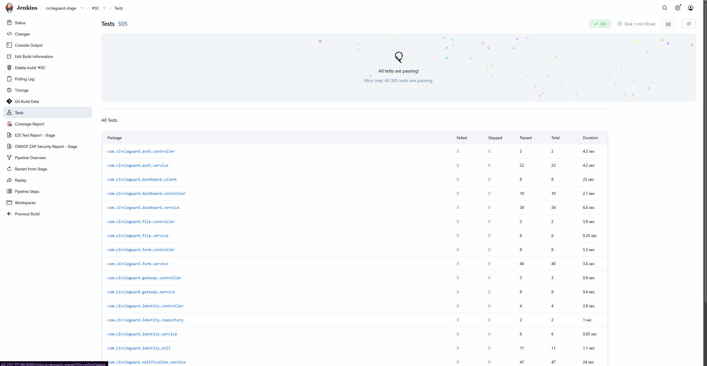

### 5.2. Implementar pruebas de integración entre servicios relacionados

Los tests de integración usan **Testcontainers** para levantar instancias reales de las dependencias, garantizando que el comportamiento en CI es idéntico al de producción:

| Test | Dependencias reales levantadas |
|------|-------------------------------|
| `JwtGatewayValidationIntegrationTest` | Redis (Testcontainers) |
| `QrStatusCacheIntegrationTest` | Redis (Testcontainers) |
| `SurveyKafkaIntegrationTest` | EmbeddedKafka + PostgreSQL |
| Tests de repositorio | PostgreSQL (Testcontainers) |
| Tests Neo4j | Neo4j (Testcontainers) |

El reporte muestra los tests de Testcontainers con sus tiempos reales de conexión a las bases de datos. Los tiempos más altos (3–8 s) corresponden al arranque de los contenedores Docker de PostgreSQL y Neo4j en el agente de Jenkins.

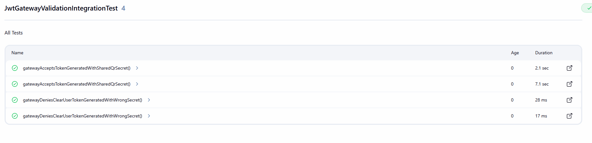

### 5.3. Implementar pruebas E2E para flujos completos de usuario

Implementadas en Python/pytest ([tests/e2e/](tests/e2e/)), ejecutadas contra el cluster de Kubernetes real en el pipeline de stage. Cubren 6 flujos completos de negocio end-to-end verificando la integración real entre microservicios:

| Archivo | Flujo cubierto |
|---------|---------------|
| `test_login_flow.py` | Login + JWT token |
| `test_notification_flow.py` | Notificaciones vía Kafka |
| `test_admin_correction_flow.py` | Corrección de estado por admin |
| `test_health_survey_flow.py` | Creación y envío de encuesta |
| `test_campus_entry_flow.py` | Validación QR en entrada |
| `test_status_promotion_flow.py` | Cambio de estado en Neo4j |

El reporte pytest muestra los 16 tests en verde con sus tiempos reales. Los tests más lentos (10–30 s) cubren flujos con Kafka, donde la propagación asíncrona requiere polling.

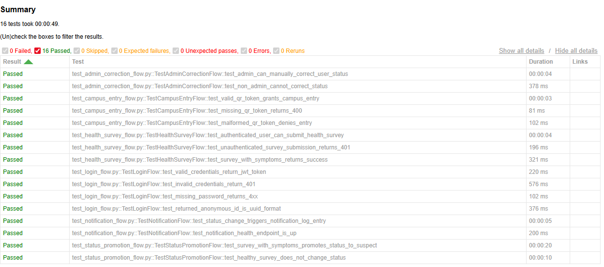

### 5.4. Implementar pruebas de rendimiento y estrés con Locust

Configuración: **100 usuarios simultáneos**, spawn rate 10/s, duración 5 minutos. Resultado esperado: **~62.5 req/s, 0 fallos**.

_Pendiente de ejecución — el pipeline master (que incluye el stage de Locust) se ejecuta en el primer merge a `main`._


### 5.5. Implementar pruebas de seguridad (OWASP ZAP o similar)

OWASP ZAP Baseline Scan se ejecuta automáticamente en el pipeline de stage y master contra el gateway-service desplegado en Kubernetes. Implementado en `Jenkinsfile.stage` y `Jenkinsfile.master`. — [PR #35](https://github.com/Electromayonaise/Circle-Guard-IngSoV/pull/35)

El reporte clasifica las vulnerabilidades detectadas por nivel de riesgo (Informational, Low, Medium, High). El pipeline falla automáticamente si encuentra alertas de riesgo ALTO o CRÍTICO.

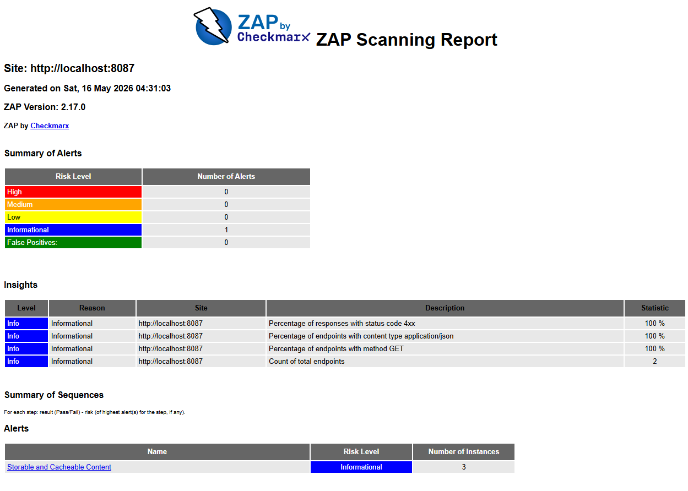

### 5.6. Generar informes de cobertura y calidad de pruebas

El reporte **JaCoCo** se genera en el pipeline de stage y master para cada microservicio. El gate de cobertura mínima es **60% de cobertura de líneas** por servicio. El reporte detalla cobertura por paquete (instrucciones, ramas, líneas, métodos, clases), permitiendo identificar exactamente qué código no está cubierto.

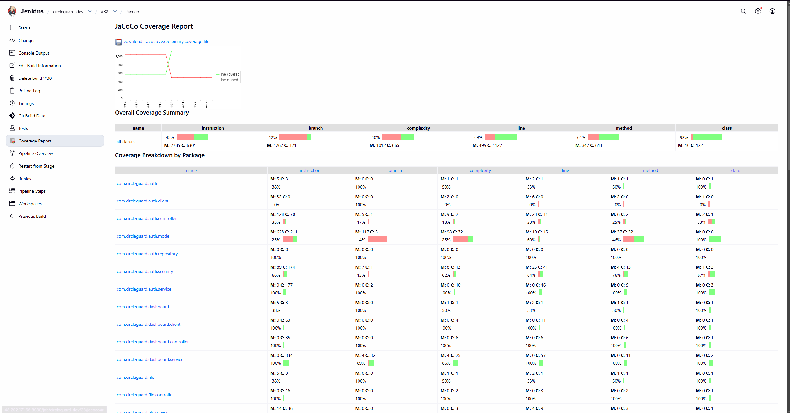

### 5.7. Configurar ejecución automatizada en pipelines

La ejecución de pruebas es 100% automática: los pipelines de Jenkins se activan mediante **webhooks de GitHub** configurados en el repositorio para los eventos `push` y `pull_request`. Cada webhook apunta a `http://48.202.171.66:8080/github-webhook/` y Jenkins determina qué pipeline ejecutar según la rama del evento:

| Branch | Pipeline disparado | Ambiente |
|--------|-------------------|----------|
| `feature/*` | `circleguard-dev` | `dev` |
| `develop` | `circleguard-stage` | `stage` |
| `main` | `circleguard-master` | `master` |

Todos los tipos de prueba se ejecutan automáticamente en el pipeline correspondiente:

| Tipo de prueba | Pipeline | Stage |
|----------------|----------|-------|
| Unitarias + Integración | Dev, Stage, Master | `Unit Tests` |
| E2E | Stage, Master | `E2E Tests` |
| Cobertura JaCoCo | Stage, Master | `Unit Tests` (con jacoco plugin) |
| OWASP ZAP | Stage, Master | `Security Scan` |
| Locust rendimiento | Master | `Performance Tests` |

El pipeline de stage (build #50) muestra la ejecución encadenada de todos los stages de prueba, ejecutándose automáticamente sin intervención manual al detectar un push a `develop`.


---

## 6. Change Management y Release Notes (5%)

### 6.1. Definir un proceso formal de Change Management

Documentado en [docs/change-management/change-management.md](docs/change-management/change-management.md) — [PR #37](https://github.com/Electromayonaise/Circle-Guard-IngSoV/pull/37).

**Flujo formal de cambio:**
```
Propuesta (issue GitHub con criterios de aceptación)
  → PR con CI verde (pipeline dev/stage)
    → Revisión de código (≥1 aprobador)
      → Merge a develop → Deploy automático dev+stage
        → PR develop→main → Gate de aprobación manual
          → Deploy master → Verificación post-deploy
```

**Criterios de aprobación por ambiente:**

| Criterio | Dev | Stage | Master |
|----------|-----|-------|--------|
| Pipeline verde | ✅ | ✅ | ✅ |
| ≥1 aprobación PR | ✅ | ✅ | ✅ |
| E2E verdes | — | ✅ | ✅ |
| ZAP sin alertas críticas | — | ✅ | ✅ |
| Locust rendimiento OK | — | — | ✅ |
| JaCoCo ≥ 60% | ✅ | ✅ | ✅ |

### 6.2. Implementar generación automática de Release Notes

El stage `Generate Release Notes` en `Jenkinsfile.master` analiza los commits desde el último tag y genera `RELEASE_NOTES.md`, archivado en Jenkins como artifact:

```markdown
# Release Notes -- v1.3.0
**Release Date:** 2026-05-15
**Environment:** master
**Build:** #42

## New Features
- feat(observability): add Prometheus, Grafana, Loki, Promtail and Zipkin
- feat(security): RBAC y TLS con cert-manager para gateway-service

## Bug Fixes
- fix(ci): remove redundant pollSCM trigger
```

_Pendiente de ejecución — disponible en Jenkins (`circleguard-master` → Artifacts → `RELEASE_NOTES.md`) tras el primer merge a `main`._


### 6.3. Documentar planes de rollback

Los procedimientos completos de rollback por ambiente están documentados en [docs/change-management/change-management.md#4-planes-de-rollback](docs/change-management/change-management.md#4-planes-de-rollback). El mecanismo de rollback en Kubernetes usa `kubectl rollout undo deployment/<svc> -n <namespace>` para volver a la imagen anterior, aprovechando el historial de ReplicaSets.

### 6.4. Implementar sistema de etiquetado de releases

El stage `Tag Release` en `Jenkinsfile.master` crea un tag Git `vX.Y.Z` calculado por SemVer automático y lo sube al repositorio. Las imágenes Docker se publican con el mismo tag en ACR.

_Pendiente de ejecución — disponible en `https://github.com/Electromayonaise/Circle-Guard-IngSoV/releases` tras el primer merge a `main`._


---

## 7. Observabilidad y Monitoreo (10%)

Toda la observabilidad está implementada en [k8s/observability/](k8s/observability/) y se despliega automáticamente en el namespace `monitoring`. — [PR #38](https://github.com/Electromayonaise/Circle-Guard-IngSoV/pull/38)

| Componente | Imagen | Puerto | Propósito |
|------------|--------|--------|-----------|
| Prometheus | `prom/prometheus:v2.51.2` | 9090 | Scraping de métricas |
| Grafana | `grafana/grafana:10.4.1` | 3000 | Dashboards y visualización |
| Loki | `grafana/loki:2.9.8` | 3100 | Agregación de logs |
| Promtail | `grafana/promtail:2.9.4` | DaemonSet | Recolección de logs de pods |
| Zipkin | `openzipkin/zipkin` | 9411 | Tracing distribuido |

Todos los 8 microservicios exponen métricas y trazas mediante:
```kotlin
implementation("org.springframework.boot:spring-boot-starter-actuator")
runtimeOnly("io.micrometer:micrometer-registry-prometheus")
implementation("io.micrometer:micrometer-tracing-bridge-brave")
implementation("io.zipkin.reporter2:zipkin-reporter-brave")
```

### 7.1. Implementar stack de monitoreo con Prometheus y Grafana

Prometheus scrape los 8 microservicios en los 3 namespaces en `/actuator/prometheus` cada 15s, configurado en [k8s/observability/prometheus/configmap.yaml](k8s/observability/prometheus/configmap.yaml).

La vista de Targets en Prometheus muestra los 8 microservicios en estado **UP** con la marca de tiempo del último scrape exitoso. Todos los targets en `dev` y `stage` están activos; `master` se activa tras el primer deploy de producción.

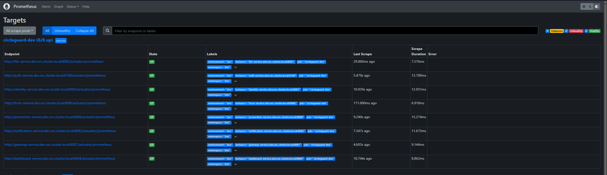

La consola de Prometheus permite ejecutar queries PromQL directamente sobre las métricas de los microservicios (HTTP request rate, JVM heap, contadores de requests), que son los mismos datos que alimentan los dashboards de Grafana en tiempo real.

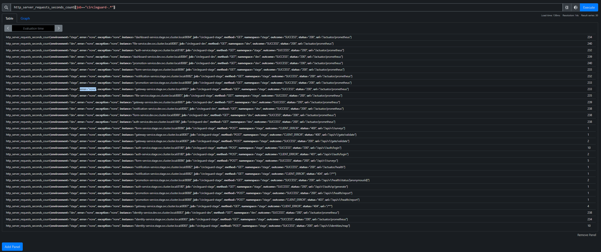

El namespace `monitoring` en Azure Portal muestra los 5 componentes del stack corriendo: Prometheus, Grafana, Loki, Zipkin y los dos pods del DaemonSet Promtail (uno por nodo AKS). Todos en estado Running/Ready.

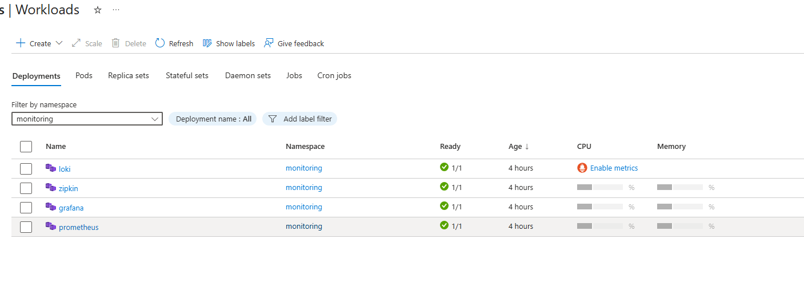

### 7.2. Configurar ELK Stack (Elasticsearch, Logstash, Kibana) para gestión de logs

Se implementó **Loki + Promtail** como alternativa a ELK, más liviana y nativa de Kubernetes. Promtail corre como DaemonSet con ClusterRole para descubrir todos los pods del cluster mediante Kubernetes Service Discovery. Los logs se etiquetan con `namespace`, `pod`, `container` y `app`, y se envían a Loki para su agregación y consulta desde Grafana.

La query `{namespace="dev"}` en Grafana Explore retorna logs en tiempo real de todos los pods del namespace dev. La imagen muestra logs del `promotion-service` con trazas de Kafka (snapshot KRaft) y Neo4j (graph cleanup), con timestamps y niveles de log parseados correctamente por el pipeline CRI de Promtail.

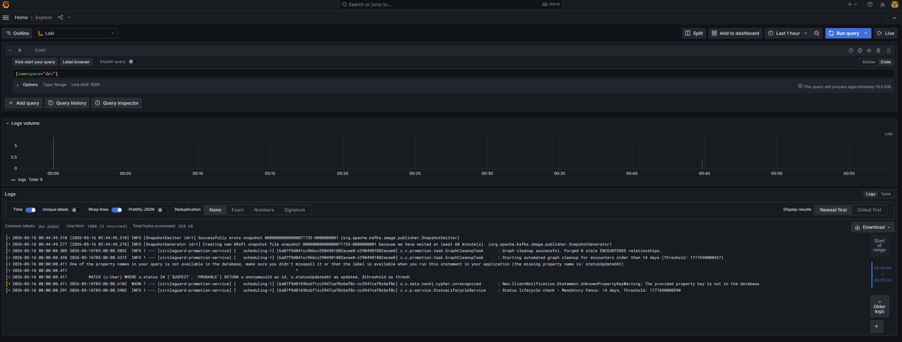

### 7.3. Implementar dashboards relevantes para cada servicio

Grafana tiene dos dashboards provisionados automáticamente vía ConfigMap:

**Dashboard Técnico** ([k8s/observability/grafana/configmap-dashboard-technical.yaml](k8s/observability/grafana/configmap-dashboard-technical.yaml)): HTTP Request Rate por servicio, HTTP Error Rate (4xx/5xx), JVM Heap Used, JVM Live Threads. Los datos provienen de Prometheus scrapeando los endpoints `/actuator/prometheus` de cada servicio cada 15 segundos.

Los datasources Prometheus y Loki aparecen con el estado "Data source connected and labels found", confirmando conectividad exitosa desde Grafana hacia ambas fuentes de datos.

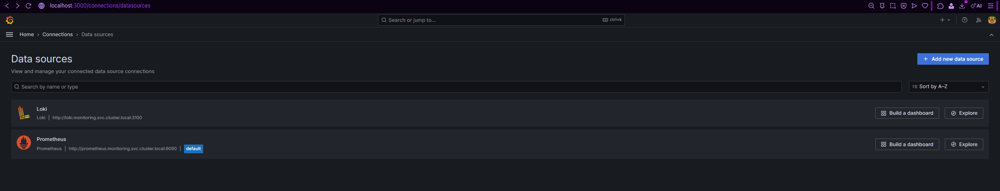

El dashboard técnico muestra las métricas de los 8 microservicios en tiempo real: HTTP Request Rate por servicio, HTTP Error Rate 4xx/5xx, JVM Heap Used y JVM Live Threads.

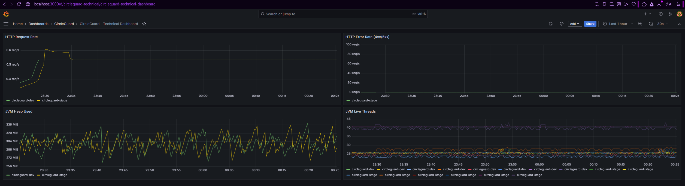

**Dashboard de Negocio** ([k8s/observability/grafana/configmap-dashboard-business.yaml](k8s/observability/grafana/configmap-dashboard-business.yaml)): La fila superior tiene tres paneles de métricas de dominio alimentados por Prometheus — QR Validations Rate (entradas al campus vía gateway-service), Identity Operations Rate (mapeos de identidad y visitantes en identity-service) y Health Workflow Rate (encuestas y promociones de estado). La fila inferior muestra Log Rate y Error Log Count desde Loki, y el panel de Recent Error Logs para trazabilidad de incidentes.


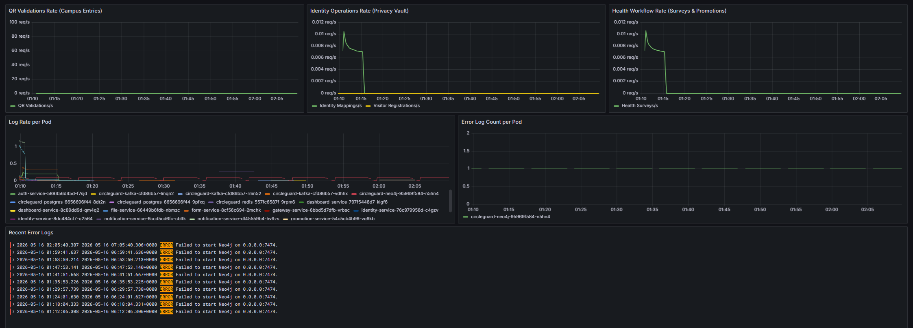

### 7.4. Configurar alertas para situaciones críticas

Se configuraron 4 reglas de alerta en Grafana Unified Alerting, provisionadas automáticamente vía ConfigMap ([k8s/observability/grafana/configmap-alerting.yaml](k8s/observability/grafana/configmap-alerting.yaml)) montado en `/etc/grafana/provisioning/alerting/`. Las reglas cargan automáticamente al iniciar Grafana sin intervención manual.

| Alerta | Condición | Severidad | `for` |
|--------|-----------|-----------|-------|
| **High 5xx Error Rate** | `sum(rate(http_server_requests_seconds_count{status=~"5.."}[5m])) > 0.05 req/s` | critical | 5 min |
| **Service Unreachable** | `min(up{job=~"circleguard-.*"}) < 1` (target caído en Prometheus) | critical | 2 min |
| **High JVM Heap Usage** | `heap_used / heap_max > 80%` en cualquier servicio | warning | 5 min |
| **Elevated 4xx Rate** | `sum(rate(...status=~"4..") by (job)) > 0.5 req/s` | warning | 5 min |

Las reglas usan el pipeline estándar de Grafana Unified Alerting: query Prometheus → reduce (last) → threshold, lo que permite visualizar el estado de las alertas (`Normal`, `Pending`, `Firing`) directamente en el panel de Alerting de Grafana sin necesidad de AlertManager externo.

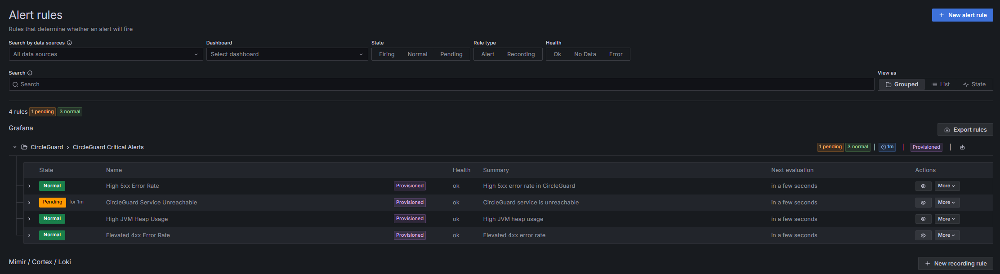

### 7.5. Implementar tracing distribuido (Jaeger, Zipkin, etc.)

Todos los microservicios reportan trazas a Zipkin vía `micrometer-tracing-bridge-brave`. Cada request genera un `traceId` único propagado entre servicios vía headers HTTP (`X-B3-TraceId`, `X-B3-SpanId`). La configuración se inyecta desde el ConfigMap:
```yaml
MANAGEMENT_ZIPKIN_TRACING_ENDPOINT: "http://zipkin.monitoring.svc.cluster.local:9411/api/v2/spans"
MANAGEMENT_TRACING_SAMPLING_PROBABILITY: "1.0"
```

Para generar trazas se realizó un request POST al endpoint `/api/v1/identities/visitor` del identity-service, que retornó el `anonymousId` UUID `a4f70e19-81ad-4095-8fb6-3624ced14c19`, confirmando que el flujo completo (recepción → consulta PostgreSQL → generación de ID anónimo → respuesta) fue ejecutado y trazado correctamente.

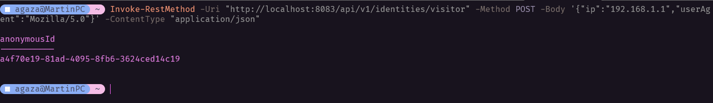

La lista de trazas en Zipkin muestra 8 microservicios siendo trazados con sus spans y duraciones. Las trazas de `/actuator/prometheus` con 5 spans evidencian llamadas internas del servicio a sus dependencias durante el scrape de Prometheus.

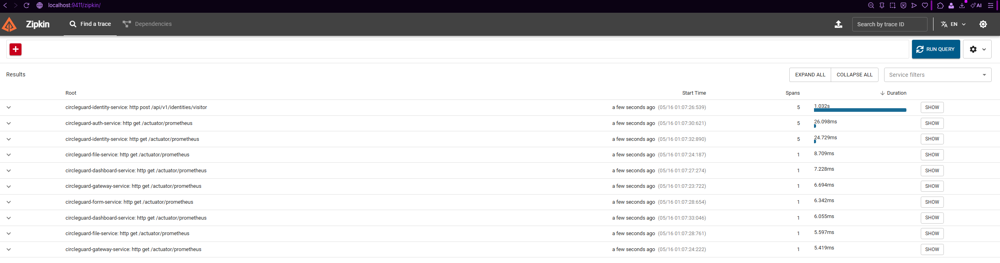

El detalle de una traza muestra el árbol de spans: el span raíz es el request HTTP entrante, y los spans hijos representan las operaciones internas (consultas a PostgreSQL, llamadas a Redis, propagación a servicios dependientes) con su duración individual.

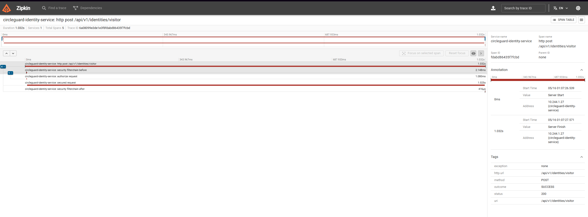

### 7.6. Configurar health checks y readiness/liveness probes

Todos los deployments tienen configurados `startupProbe` y `readinessProbe` TCP para garantizar que Kubernetes solo envíe tráfico a pods listos y reinicie pods fallidos:

```yaml
startupProbe:
  tcpSocket:
    port: {puerto}
  failureThreshold: 120   # hasta 20 min para arranque JVM
  periodSeconds: 10
readinessProbe:
  tcpSocket:
    port: {puerto}
  initialDelaySeconds: 5
  periodSeconds: 10
```

Los endpoints `/actuator/health/liveness` y `/actuator/health/readiness` de Spring Boot Actuator están habilitados mediante `MANAGEMENT_HEALTH_PROBES_ENABLED: "true"` en el ConfigMap.

### 7.7. Implementar métricas de negocio además de métricas técnicas

El **Dashboard de Negocio** ([k8s/observability/grafana/configmap-dashboard-business.yaml](k8s/observability/grafana/configmap-dashboard-business.yaml)) implementa métricas de dominio específicas de CircleGuard usando los datos de Prometheus ya scrapeados:

| Panel | Métrica de negocio | Query |
|-------|--------------------|-------|
| **QR Validations Rate** | Tasa de validaciones de código QR en la entrada del campus | `rate(http_server_requests_seconds_count{uri="/api/v1/gate/validate"}[5m])` |
| **Identity Operations Rate** | Tasa de mapeos de identidad (Privacy Vault) y registros de visitantes | `rate(...{uri="/api/v1/identities/map"})` + `rate(...{uri="/api/v1/identities/visitor"})` |
| **Health Workflow Rate** | Tasa de encuestas de salud enviadas y cambios de estado de salud en Neo4j | `rate(...{uri=~"/api/v1/surveys.*"})` + `rate(...{uri=~"/api/v1/promotions.*"})` |

Estos tres paneles miden operaciones de negocio del dominio (entradas al campus, privacidad de identidades, flujos de salud), distintas de las métricas técnicas de infraestructura (JVM, HTTP genérico) del dashboard técnico. Los paneles de Log Rate y Error Log Count (Loki) complementan la vista operacional.

Ver imagen actualizada del Dashboard de Negocio en sección 7.3.

---

## 8. Seguridad (5%)

[PR #36 — feat/security-rbac-tls](https://github.com/Electromayonaise/Circle-Guard-IngSoV/pull/36)

### 8.1. Implementar escaneo continuo de vulnerabilidades

OWASP ZAP Baseline Scan corre automáticamente en cada ejecución del pipeline de stage y master, escaneando el gateway-service desplegado en Kubernetes. El pipeline falla si se detectan alertas de riesgo ALTO o CRÍTICO, garantizando escaneo continuo en cada ciclo de integración.

Ver reporte completo en sección 5.5.

### 8.2. Implementar gestión segura de secretos

Todos los valores sensibles (contraseñas de BD, JWT secret, Neo4j password) se almacenan en el Kubernetes Secret `circleguard-secrets` de tipo `Opaque`, gestionado por Terraform con `lifecycle { ignore_changes = [data] }` para prevenir sobreescrituras accidentales de valores rotados manualmente. Los datos están cifrados en etcd y solo son accesibles por los pods con el RoleBinding que otorga permisos `get` sobre `secrets`.

El output de `kubectl get secrets -n dev` muestra el secret `circleguard-secrets` activo. Los valores sensibles no son visibles en texto plano — solo se muestran el nombre, tipo y edad del secret.

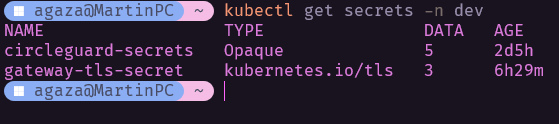

### 8.3. Configurar RBAC para acceso a recursos

Cada microservicio tiene su propio `ServiceAccount`, `Role` (acceso mínimo a ConfigMaps y Secrets) y `RoleBinding`, implementado en `k8s/{svc}-service/rbac.yaml` para los 8 servicios:

```yaml
apiVersion: rbac.authorization.k8s.io/v1
kind: Role
rules:
  - apiGroups: [""]
    resources: ["configmaps", "secrets"]
    verbs: ["get", "list"]
```

El output de `kubectl get serviceaccounts -n dev` muestra un ServiceAccount dedicado por cada microservicio, aplicando el principio de mínimo privilegio: ningún pod comparte credenciales con otro servicio.

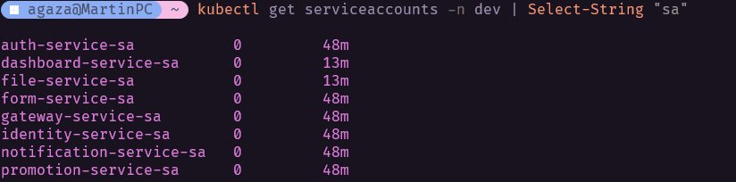

El output de `kubectl get roles -n dev` muestra los 8 Roles RBAC activos. Cada Role otorga únicamente los permisos mínimos necesarios (`get`, `list`) sobre `configmaps` y `secrets`, sin acceso a otros recursos del cluster.

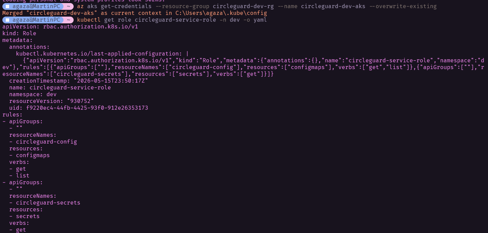

El output de `kubectl get rolebindings -n dev` muestra los RoleBindings que asocian cada ServiceAccount con su Role correspondiente, con scope limitado al namespace `dev`.

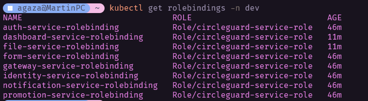

El output de `kubectl get pods -n dev -o wide` confirma que cada pod corre con su ServiceAccount dedicado (columna SERVICE ACCOUNT) en tiempo de ejecución, validando que el principio de mínimo privilegio está activo no solo a nivel de definición sino en los pods desplegados.

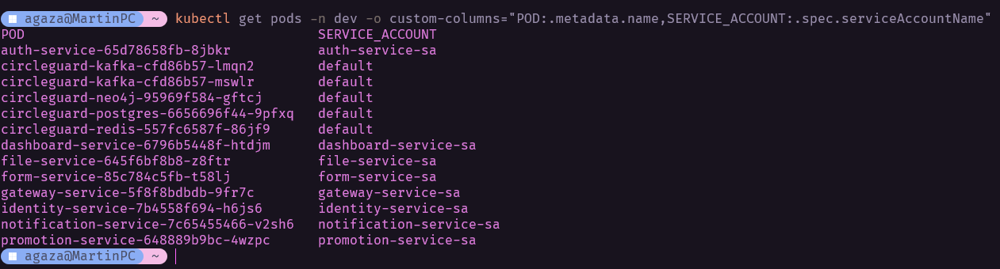

### 8.4. Implementar TLS para servicios expuestos públicamente

Configurado con **cert-manager** en el cluster ([k8s/cert-manager/](k8s/cert-manager/)):

1. **ClusterIssuer SelfSigned** — emite certificados self-signed para el ambiente de demo
2. **Certificate** — genera `gateway-tls-secret` para `gateway-<env>.circleguard.local`
3. **Ingress** con TLS y redirect HTTPS forzado

```yaml
# k8s/cert-manager/clusterissuer-selfsigned.yaml
apiVersion: cert-manager.io/v1
kind: ClusterIssuer
metadata:
  name: selfsigned-issuer
spec:
  selfSigned: {}
```

El output de `kubectl get pods -n cert-manager` confirma que los tres componentes de cert-manager están Running: `cert-manager` (controller), `cert-manager-cainjector` e `cert-manager-webhook`.

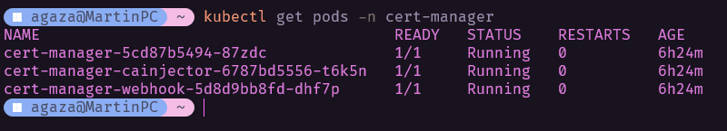

La verificación kubectl de la cadena TLS completa muestra los cuatro eslabones funcionando: `ClusterIssuer selfsigned-issuer` en estado Ready, `Certificate gateway-tls` Ready con secret `gateway-tls-secret`, el secret de tipo `kubernetes.io/tls` generado automáticamente, y el Ingress `gateway-ingress` con `force-ssl-redirect: true` activo y LoadBalancer con IP pública asignada.

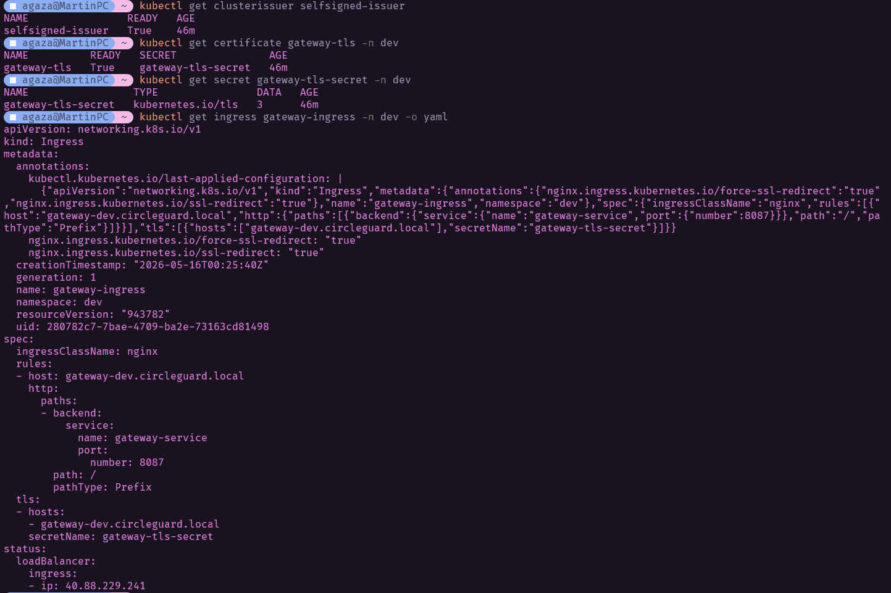

---

## 9. Documentación y Presentación (10%)

### 9.1. Documentación completa del proyecto

| Documento | Ubicación | Contenido |
|-----------|-----------|-----------|
| Estrategia de branching | [docs/agile/branching-strategy.md](docs/agile/branching-strategy.md) | GitFlow simplificado, convenciones de ramas y commits |
| Change Management y Rollback | [docs/change-management/change-management.md](docs/change-management/change-management.md) | Proceso formal de cambios, criterios por ambiente, planes de rollback |
| Informe Final | [INFORME_FINAL.md](INFORME_FINAL.md) | Este documento: todos los puntos del proyecto con evidencias |

### 9.2. Repositorio Git organizado

```
Circle-Guard-IngSoV/
├── services/          ← 8 microservicios Spring Boot (Kotlin)
├── k8s/               ← manifests Kubernetes por servicio + observabilidad + cert-manager
├── terraform/         ← IaC modular con Terraform Cloud backend
├── tests/             ← E2E (pytest) + Performance (Locust)
├── docs/              ← branching strategy, change management
├── docker/            ← Dockerfiles por servicio
├── jenkins/           ← imagen Docker de Jenkins con DinD
├── images/            ← evidencias de RBAC, TLS y observabilidad
├── Jenkinsfile.dev    ← pipeline de desarrollo
├── Jenkinsfile.stage  ← pipeline de staging
└── Jenkinsfile.master ← pipeline de producción con gates completos
```

**8 microservicios** desplegados en AKS:

| Servicio | Puerto | Base de datos | Propósito |
|----------|--------|---------------|-----------|
| auth-service | 8180 | PostgreSQL (`circleguard_auth`) | Autenticación JWT |
| identity-service | 8083 | PostgreSQL (`circleguard_identity`) | Vault de identidades cifradas |
| form-service | 8086 | PostgreSQL (`circleguard_form`) | Encuestas de salud dinámicas |
| promotion-service | 8088 | Neo4j (grafo) | Estado de salud en grafo |
| notification-service | 8082 | — | Alertas vía Kafka |
| gateway-service | 8087 | Redis (caché QR) | API Gateway + JWT validation |
| dashboard-service | 8084 | PostgreSQL (`circleguard_dashboard`) | Analíticas con k-anonimato |
| file-service | 8085 | — | Carga de archivos adjuntos |

### 9.3. Costos de infraestructura

| Recurso | SKU | Nodos | Costo estimado/mes |
|---------|-----|-------|-------------------|
| AKS default node pool | Standard_B2s | 2 | ~$70 USD |
| AKS jenkins node pool | Standard_D2s_v3 | 1 | ~$70 USD |
| Azure Container Registry | Basic | — | ~$5 USD |
| Discos PVC | Standard_LRS | — | ~$5 USD |
| **Total estimado** | | | **~$150 USD/mes** |

El análisis de costos en Azure Portal refleja el acumulado de los primeros días de operación del cluster, incluyendo el AKS, el ACR, los discos de los PVCs y el uso de recursos durante pruebas y despliegues.

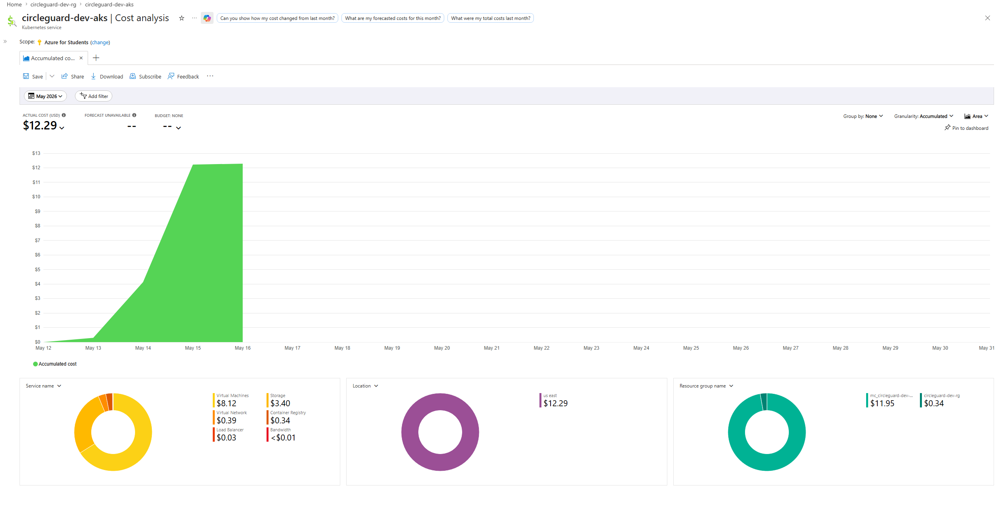

### 9.4. Manual de operaciones básico

El manual de operaciones completo está disponible en **[docs/operations/operations-manual.md](docs/operations/operations-manual.md)**. Cubre 13 secciones: accesos a herramientas, estado del cluster, logs, despliegue, rollback, reinicio de servicios, gestión de secretos, escalado, operaciones Terraform, CI/CD, monitoreo, resolución de problemas comunes y acceso al cluster AKS.

**Accesos rápidos:**

| Herramienta | URL / Comando |
|-------------|---------------|
| Jenkins | `http://48.202.171.66:8080` |
| Grafana | `kubectl port-forward svc/grafana -n monitoring 3000:3000` → `http://localhost:3000` |
| Prometheus | `kubectl port-forward svc/prometheus -n monitoring 9090:9090` → `http://localhost:9090` |
| Zipkin | `kubectl port-forward svc/zipkin -n monitoring 9411:9411` → `http://localhost:9411` |
| Loki | Accesible vía Grafana Explore (datasource Loki) |

**Operaciones frecuentes:**

```powershell
# Estado del cluster
kubectl get pods --all-namespaces

# Logs en tiempo real de un servicio
kubectl logs -l app=auth-service -n dev --tail=100 -f

# Rollback al deploy anterior
kubectl rollout undo deployment/auth-service -n dev

# Reinicio rolling de un servicio
kubectl rollout restart deployment/auth-service -n dev

# Ver recursos consumidos
kubectl top pods -n dev
```

**Rollback de infraestructura:** ver sección 5 del [manual de operaciones](docs/operations/operations-manual.md#5-rollback). El estado de Terraform está en Terraform Cloud (workspace `circleguard-dev`, organización `IngSoV`) y puede restaurarse a cualquier revisión anterior desde la UI.

**Rotación de secretos:** los valores sensibles están en el Kubernetes Secret `circleguard-secrets`. Para rotar, actualizar el valor del secret y reiniciar los deployments que lo consumen (`kubectl rollout restart deployment -n dev`). El secret está protegido en Terraform con `lifecycle { ignore_changes = [data] }` para evitar que Terraform sobreescriba valores rotados manualmente.

### 9.5. Video demostrativo del funcionamiento

> _Pendiente — se grabará previo a la entrega final._

### 9.6. Presentación del proyecto

> _Pendiente — se preparará para la sesión de presentación (20–30 minutos)._
