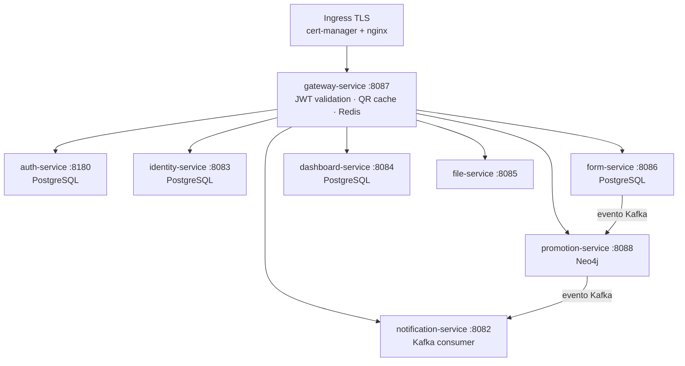

# CircleGuard

> Sistema de trazabilidad de contactos y control de acceso para campus universitario — Proyecto Final IngeSoft V

**CircleGuard** protege la salud del campus mediante control de acceso con QR, trazabilidad de contactos en grafo y anonimización criptográfica de identidades. Ningún nombre real sale del vault de identidades: el grafo de contactos opera exclusivamente con IDs anónimos.

---

## Informe Final

> **[→ Ver Informe Final del Proyecto](INFORME_FINAL.md)**

El informe documenta la evidencia de cumplimiento de todos los puntos del rubric: metodología ágil, Terraform IaC, patrones de diseño, CI/CD, pruebas, change management, observabilidad, seguridad y documentación.

---

## Equipo

| Integrante | GitHub |
|------------|--------|
| Martin Gomez | [@Electromayonaise](https://github.com/Electromayonaise) |
| Mateo Rubio | [@MateoRAR](https://github.com/MateoRAR) |

**Curso:** Ingeniería de Software V — Universidad ICESI  
**Cluster:** Azure Kubernetes Service — `circleguard-dev-aks` (eastus)

---

## Arquitectura

8 microservicios Spring Boot (Kotlin) desplegados en AKS, con bases de datos dedicadas y mensajería asíncrona vía Kafka:



| Servicio | Puerto | Base de datos | Propósito |
|----------|--------|---------------|-----------|
| `auth-service` | 8180 | PostgreSQL | Autenticación JWT |
| `identity-service` | 8083 | PostgreSQL | Vault de identidades cifradas |
| `form-service` | 8086 | PostgreSQL | Encuestas de salud dinámicas |
| `promotion-service` | 8088 | Neo4j | Estado de salud en grafo recursivo |
| `notification-service` | 8082 | — | Alertas vía Kafka |
| `gateway-service` | 8087 | Redis | API Gateway + validación QR |
| `dashboard-service` | 8084 | PostgreSQL | Analíticas con k-anonimato |
| `file-service` | 8085 | — | Carga de archivos adjuntos |

---

## Stack Tecnológico

**Backend**


**Bases de datos**


**Infraestructura**


**CI/CD y Observabilidad**


**Pruebas**


---

## Estructura del Repositorio

```
Circle-Guard-IngSoV/
├── services/                  ← 8 microservicios Spring Boot (Kotlin)
│   ├── circleguard-auth-service/
│   ├── circleguard-identity-service/
│   ├── circleguard-form-service/
│   ├── circleguard-promotion-service/
│   ├── circleguard-notification-service/
│   ├── circleguard-gateway-service/
│   ├── circleguard-dashboard-service/
│   └── circleguard-file-service/
├── k8s/                       ← Manifests Kubernetes por servicio
│   ├── <svc>-service/         ← deployment, service, rbac por microservicio
│   ├── observability/         ← Prometheus, Grafana, Loki, Promtail, Zipkin
│   └── cert-manager/          ← ClusterIssuer, Certificate, Ingress TLS
├── terraform/                 ← IaC modular (AKS, ACR, namespaces, infra)
│   ├── modules/               ← aks-cluster, acr, k8s-namespace, k8s-infra
│   └── environments/          ← dev.tfvars, stage.tfvars, prod.tfvars
├── tests/
│   ├── e2e/                   ← 16 pruebas E2E en Python/pytest
│   └── performance/           ← Locust (100 usuarios, 5 min)
├── docs/
│   ├── agile/                 ← branching-strategy.md
│   ├── change-management/     ← change-management.md (rollback plans)
│   ├── diagrams/              ← terraform-infrastructure.md (Mermaid)
│   └── operations/            ← operations-manual.md (13 secciones)
├── docker/                    ← Dockerfiles por servicio
├── jenkins/                   ← Imagen Jenkins con DinD y Azure CLI
├── images/                    ← Evidencias del informe final
├── Jenkinsfile.dev            ← Pipeline feature/* → namespace dev
├── Jenkinsfile.stage          ← Pipeline develop → namespace stage
├── Jenkinsfile.master         ← Pipeline main → namespace master (con gates)
└── INFORME_FINAL.md           ← Informe completo con evidencias
```

---

## CI/CD

Tres pipelines Jenkins activados por **webhook de GitHub**:

| Pipeline | Branch | Namespace | Stages |
|----------|--------|-----------|--------|
| Dev | `feature/*` | `dev` | Build → Unit Tests → Docker Push → Deploy → Smoke Tests |
| Stage | `develop` | `stage` | Build → Unit Tests → Docker Push → Deploy → Integration → E2E → ZAP |
| Master | `main` | `master` | Build → SemVer → Unit Tests (JaCoCo) → Docker Push → Deploy → E2E → ZAP → Locust → Release Notes → Tag |

**Jenkins:** `http://48.202.171.66:8080`

---

## Observabilidad

Stack completo en el namespace `monitoring`:

| Herramienta | Acceso |
|-------------|--------|
| Grafana (dashboards técnico + negocio) | `kubectl port-forward svc/grafana -n monitoring 3000:3000` |
| Prometheus (métricas) | `kubectl port-forward svc/prometheus -n monitoring 9090:9090` |
| Zipkin (tracing distribuido) | `kubectl port-forward svc/zipkin -n monitoring 9411:9411` |
| Loki (logs) | vía Grafana Explore |

Grafana incluye 4 alertas provisionadas como código: High 5xx Rate, Service Unreachable, High JVM Heap y Elevated 4xx Rate.

---

## Seguridad

- **RBAC**: `ServiceAccount` + `Role` + `RoleBinding` por microservicio (mínimo privilegio)
- **TLS**: cert-manager con `ClusterIssuer` selfsigned → `Certificate` → `gateway-tls-secret` → Ingress con `force-ssl-redirect: true`
- **Secretos**: Kubernetes Secret `circleguard-secrets` (cifrado en etcd), gestionado por Terraform con `lifecycle { ignore_changes = [data] }`
- **OWASP ZAP**: Baseline Scan automático en cada pipeline de stage y master

---

## Pruebas

```bash
# Unitarias e integración (desde cualquier servicio)
./gradlew test

# Reporte de cobertura JaCoCo
./gradlew jacocoTestReport

# E2E contra el cluster (requiere kubeconfig activo)
cd tests/e2e
pip install -r requirements.txt
pytest --tb=short -v

# Performance (Locust)
cd tests/performance
locust -f locustfile.py --headless -u 100 -r 10 -t 5m
```

**305 tests** unitarios e integración · **16 tests E2E** · cobertura mínima **60%** por servicio

---

## Desarrollo Local

Para ejecutar los servicios localmente sin Kubernetes:

```bash
# Levantar infraestructura (PostgreSQL, Neo4j, Redis, Kafka)
docker compose -f docker-compose.dev.yml up -d

# Compilar y ejecutar un servicio
cd services/circleguard-auth-service
./gradlew bootRun
```

**Requisitos:** JDK 21 · Docker Desktop · kubectl (para E2E/deploy en AKS)

---

## Despliegue en AKS

```bash
# Autenticarse con Azure
az login
az aks get-credentials --resource-group circleguard-dev-rg --name circleguard-dev-aks

# Aprovisionar infraestructura
cd terraform
terraform init
terraform apply -var-file=environments/dev.tfvars

# Los servicios se despliegan automáticamente via Jenkins al hacer push
```

Ver el [Manual de Operaciones](docs/operations/operations-manual.md) para comandos frecuentes, rollback y troubleshooting.

---

## Documentación

| Documento | Descripción |
|-----------|-------------|
| [INFORME_FINAL.md](INFORME_FINAL.md) | Evidencias completas del proyecto mapeadas al rubric |
| [docs/operations/operations-manual.md](docs/operations/operations-manual.md) | Manual de operaciones (13 secciones) |
| [docs/agile/branching-strategy.md](docs/agile/branching-strategy.md) | Estrategia de branching GitFlow |
| [docs/change-management/change-management.md](docs/change-management/change-management.md) | Change management y planes de rollback |
| [docs/diagrams/terraform-infrastructure.md](docs/diagrams/terraform-infrastructure.md) | Diagramas de arquitectura Terraform (Mermaid) |
