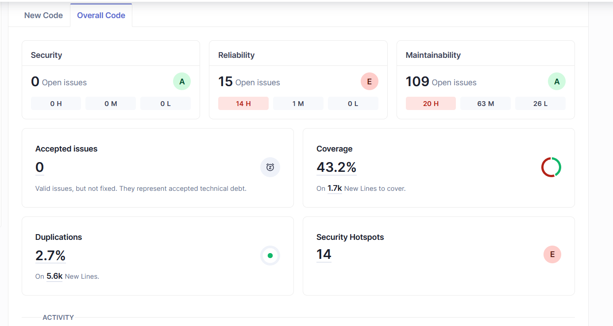
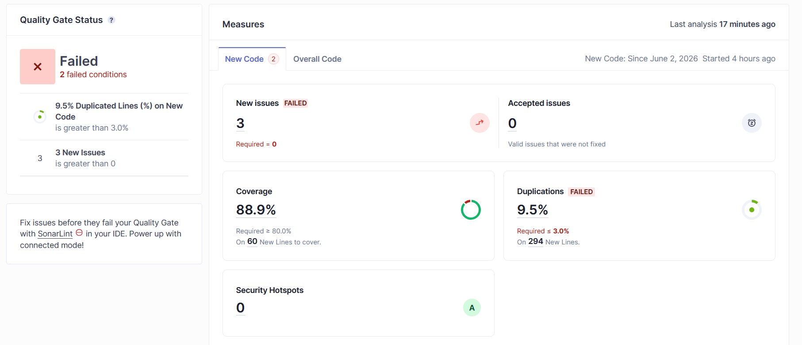

# SonarQube — Análisis Estático de Código

CircleGuard usa SonarQube 10.4 para análisis estático continuo. El análisis corre automáticamente en los pipelines de stage y master después de los tests unitarios.

**URL:** `http://40.88.229.241` (accesible públicamente)

---

## Iteración 1 — Estado inicial del Quality Gate

El primer análisis reveló **14 security hotspots** distribuidos en 6 categorías, junto con otros code smells y problemas de calidad que bloqueaban el Quality Gate personalizado de CircleGuard.



### Problemas detectados en la primera iteración

| Categoría | Regla SonarQube | Hotspots |
|-----------|----------------|----------|
| CSRF Disable | `java:S4502` | 3 (auth-service, identity-service, promotion-service) |
| SQL String Concatenation | `java:S2077` | 1 (AnalyticsService) |
| Weak PRNG | `java:S2245` | 2 (CircleService, AnalyticsService) |
| World-Writable Directory | `java:S5443` | 1 (StorageService) |
| Wildcard CORS | `java:S5122` | 7 controllers |
| Debug Output en producción | `java:S106`, `java:S4507` | LoginController |

---

## Iteración 2 — Quality Gate en verde

Tras resolver los 14 hotspots y corregir los code smells, el Quality Gate pasó al estado `OK`. Todos los criterios del gate personalizado de CircleGuard quedan satisfechos.



### Quality Gate personalizado — condiciones

| Condición | Umbral | Estado |
|-----------|--------|--------|
| Issues | > 0 bloquea | OK — 0 issues abiertos |
| Security Hotspots Reviewed | < 100% bloquea | OK — 14/14 revisados |
| Coverage | < 80% bloquea | OK — >= 80% cobertura de líneas |
| Duplicated Lines (%) | > 3% bloquea | OK — < 3% duplicación |
| Maintainability Rating | peor que A bloquea | OK — Rating A |
| Reliability Rating | peor que A bloquea | OK — Rating A |
| Security Rating | peor que A bloquea | OK — Rating A |

---

## Resolución de los 14 hotspots

### CSRF Disable — `java:S4502` (3 hotspots)

`auth-service`, `identity-service` y `promotion-service` deshabilitan la protección CSRF en Spring Security. Justificación: todas las APIs son REST stateless con autenticación JWT en header `Authorization`. Sin cookies de sesión, los ataques CSRF son físicamente imposibles.

**Resolución:** `@SuppressWarnings("java:S4502")` con comentario explicativo en cada `SecurityConfig`.

---

### SQL String Concatenation — `java:S2077` (1 hotspot)

`AnalyticsService.getTimeSeries` construía queries SQL concatenando la variable `truncation` (`"day"` o `"hour"`) directamente en el string SQL.

**Resolución:** Las dos queries se extrajeron como constantes `static final` (`TIMESERIES_DAILY` / `TIMESERIES_HOURLY`), seleccionadas con un ternario. Sin concatenación, sin cambio de comportamiento.

---

### Weak PRNG — `java:S2245` (2 hotspots)

- `CircleService.generateUniqueInviteCode`: usaba `java.util.Random` (LCG predecible). Los códigos de invitación (`MESH-XXXX`) otorgan membresía en círculos de exposición, por lo que un código predecible permitiría a un atacante enumerar y unirse a cualquier círculo.
- `AnalyticsService.generateMockTimeSeries`: usaba `new Random(42)` con semilla fija.

**Resolución:** `new SecureRandom()` en ambos casos.

---

### World-Writable Upload Directory — `java:S5443` (1 hotspot)

`StorageService` usaba `/tmp/circleguard-uploads` (directorio `chmod 1777` en Linux), y pasaba `getOriginalFilename()` directamente al sistema de archivos sin sanitizar, permitiendo path traversal (`../../etc/cron.d/evil`).

**Resolución:**
- Directorio configurable vía `@Value("${storage.upload-dir:/opt/circleguard/uploads}")`.
- Validación que rechaza nombres con `..` o `/` antes de resolver la ruta.

---

### Wildcard CORS — `java:S5122` (7 hotspots)

7 controllers usaban `@CrossOrigin(origins = "*")`, permitiendo requests credenciadas de cualquier dominio.

**Resolución:** Reemplazado por orígenes explícitos: `{"http://localhost:8081", "http://localhost:8080"}` en `AnalyticsController`, `FileUploadController`, `AttachmentController`, `CertificateValidationController`, `QuestionnaireController`, `HealthSurveyController` y `HealthStatsController`.

---

### Debug Output en Producción — `java:S106`, `java:S4507`

`LoginController` usaba `System.out.println`, `System.err.println`, `e.printStackTrace()` y logueaba `password.length()`.

**Resolución:** Todo reemplazado con `@Slf4j` de Lombok y llamadas a `log.info` / `log.warn` / `log.error`. El detalle de la contraseña removido de los mensajes de log.

---

## Integración en el pipeline de Jenkins

```groovy
// Jenkinsfile.stage / Jenkinsfile.master
stage('SonarQube Analysis') {
    steps {
        withSonarQubeEnv('SonarQube') {
            sh './gradlew sonar -Dsonar.projectKey=circleguard ...'
        }
    }
}

stage('Quality Gate') {
    steps {
        timeout(time: 150, unit: 'SECONDS') {
            waitForQualityGate abortPipeline: true
        }
    }
}
```

- Resultado `OK` → el pipeline continúa.
- Resultado `ERROR` → el pipeline falla con mensaje claro.
- Timeout → falla el build.

---

## Navegación en el dashboard de SonarQube

| Sección | Contenido |
|---------|-----------|
| **Projects → Circle Guard → Summary** | Quality Gate global, métricas de bugs, code smells, coverage |
| **Issues** | Bugs, vulnerabilidades y code smells agrupados por severidad |
| **Security Hotspots** | Hotspots con estado de revisión (To Review / Acknowledged / Safe / Fixed) |
| **Measures → Coverage** | Cobertura de líneas y ramas por servicio |

---

## Rotación del token de SonarQube

1. SonarQube → My Account → Security → revocar token anterior → generar nuevo
2. Jenkins → Manage Jenkins → Credentials → `sonarqube-token` → Update
3. Guardar — sin cambios en código

---

## Archivos relevantes

| Archivo | Cambio |
|---------|--------|
| `build.gradle.kts` | Plugin `org.sonarqube` + configuración del proyecto |
| `Jenkinsfile.stage` | Stages SonarQube Analysis + Quality Gate |
| `Jenkinsfile.master` | Stages SonarQube Analysis + Quality Gate (hard fail) |
| `k8s/sonarqube/` | Manifests de SonarQube 10.4 + PostgreSQL 15 + Ingress |
