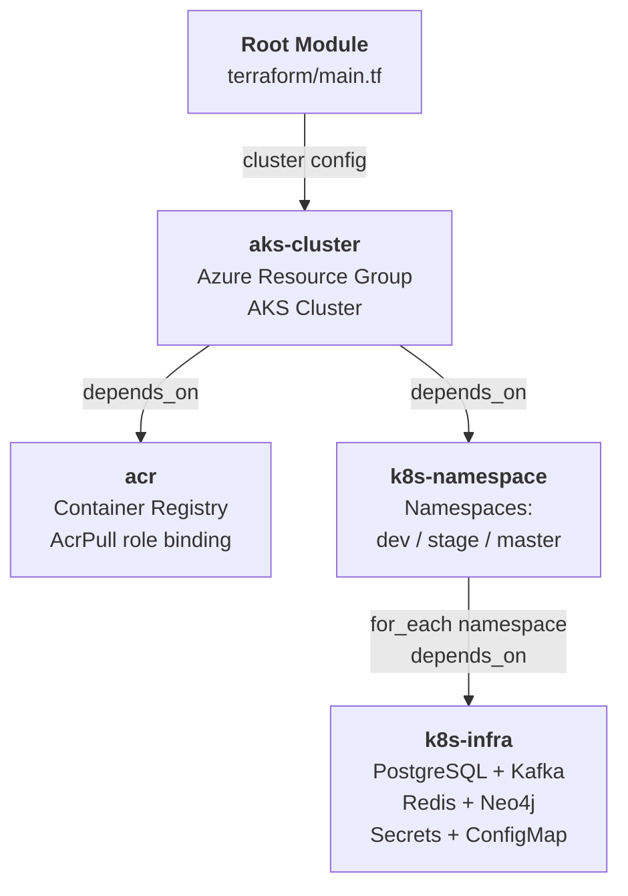
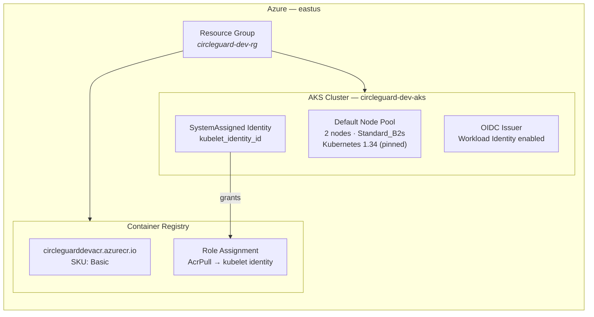
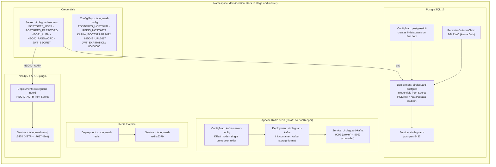
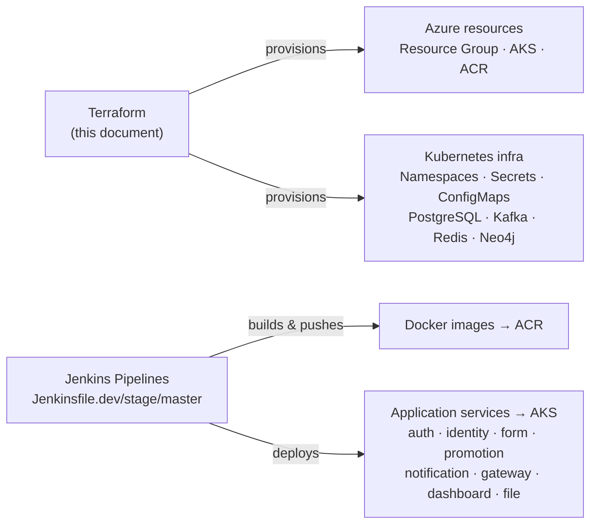

# Terraform Infrastructure Architecture

> **Rendering:** This document uses [Mermaid](https://mermaid.js.org/) diagrams that render automatically on GitHub.
> To export as PNG/SVG (e.g., for presentations), paste any diagram block into [mermaid.live](https://mermaid.live) and use the export button.

---

## Overview

Terraform manages all Azure cloud resources and Kubernetes infrastructure for CircleGuard. It does **not** manage application service deployments — those are owned exclusively by Jenkins pipelines.

**Remote state backend:** HCP Terraform Cloud, org `IngSoV`, workspace `circleguard-dev`.

The infrastructure is organized into four reusable modules called from a single root module (`terraform/main.tf`):

| Module | Provisions |
|---|---|
| `aks-cluster` | Azure Resource Group + AKS cluster with 2 nodes |
| `acr` | Azure Container Registry + AcrPull role for AKS |
| `k8s-namespace` | Kubernetes namespaces (`dev`, `stage`, `master`) |
| `k8s-infra` | Infra stack per namespace (PostgreSQL, Kafka, Redis, Neo4j, Secrets, ConfigMap) |

---

## Module Dependency Graph

The four modules have a strict dependency chain: AKS must exist before anything else, ACR and namespaces are provisioned in parallel once AKS is ready, and the infra stack is deployed last into each namespace.

---

## Azure Resources

Terraform provisions two Azure resources inside a dedicated resource group. The AKS cluster uses a system-assigned managed identity; its kubelet identity receives `AcrPull` permissions on the registry so pods can pull images without credentials.

> **Why Kubernetes 1.34 is pinned:** Without an explicit version, Azure automatically upgrades the cluster during `terraform apply`, causing a 40-minute operation. Pinning prevents unintended upgrades.

---

## Kubernetes Resources (per namespace)

The `k8s-infra` module is instantiated three times — once for `dev`, `stage`, and `master`. Each namespace gets an identical, isolated infra stack. All four databases share the same `circleguard-secrets` Secret and `circleguard-config` ConfigMap.

---

## Responsibility Boundary

> Keeping these concerns separate means infrastructure changes (e.g., scaling nodes, rotating secrets) never require a Jenkins build, and application deployments never risk modifying infrastructure state.

---

## Terraform Variables

All sensitive values are stored as encrypted variables in HCP Terraform Cloud and never committed to the repository.

| Variable | Description | Sensitive |
|---|---|:---:|
| `resource_group_name` | Azure resource group name | |
| `cluster_name` | AKS cluster name | |
| `acr_name` | ACR registry name | |
| `environment` | Environment label (tag) | |
| `postgres_user` | PostgreSQL username | |
| `postgres_password` | PostgreSQL password | Yes |
| `neo4j_password` | Neo4j password | Yes |
| `jwt_secret` | JWT signing secret | Yes |
| `ARM_CLIENT_ID` | Azure Service Principal ID | |
| `ARM_CLIENT_SECRET` | Azure Service Principal secret | Yes |
| `ARM_TENANT_ID` | Azure tenant ID | |
| `ARM_SUBSCRIPTION_ID` | Azure subscription ID | |
