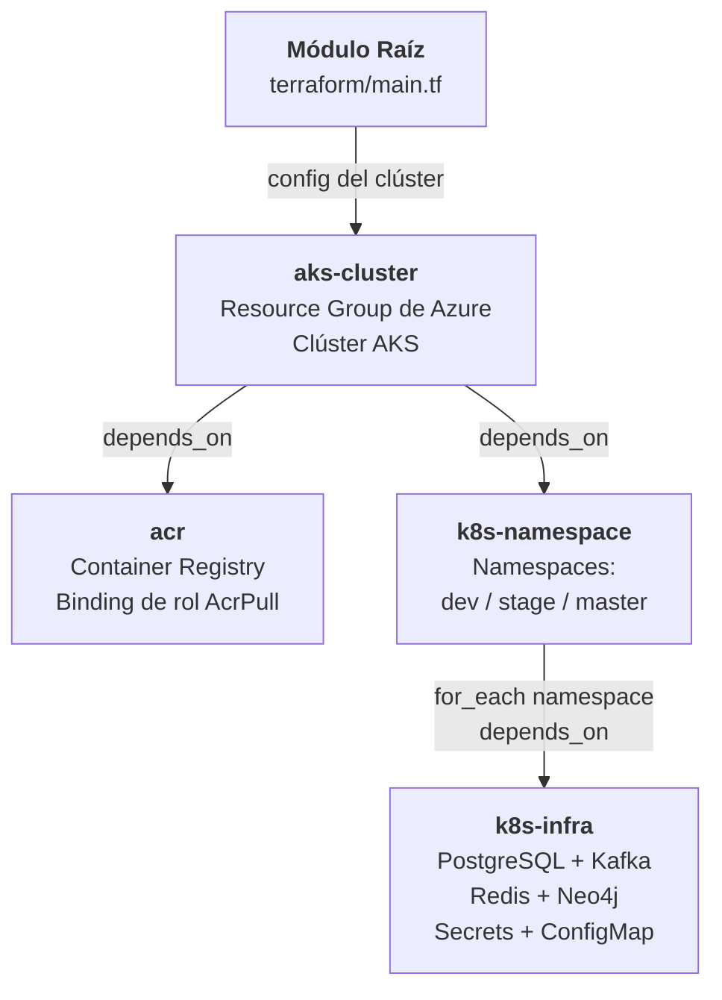
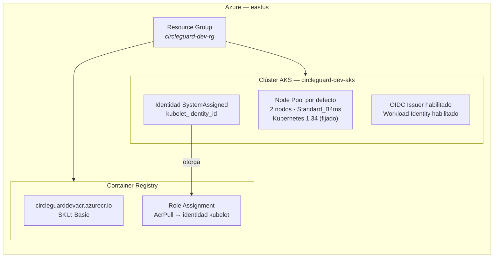
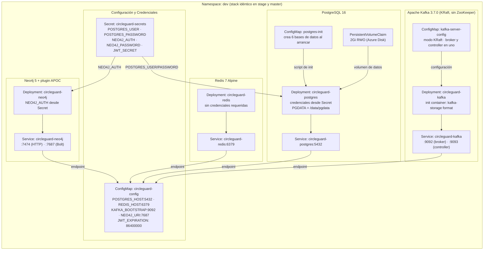
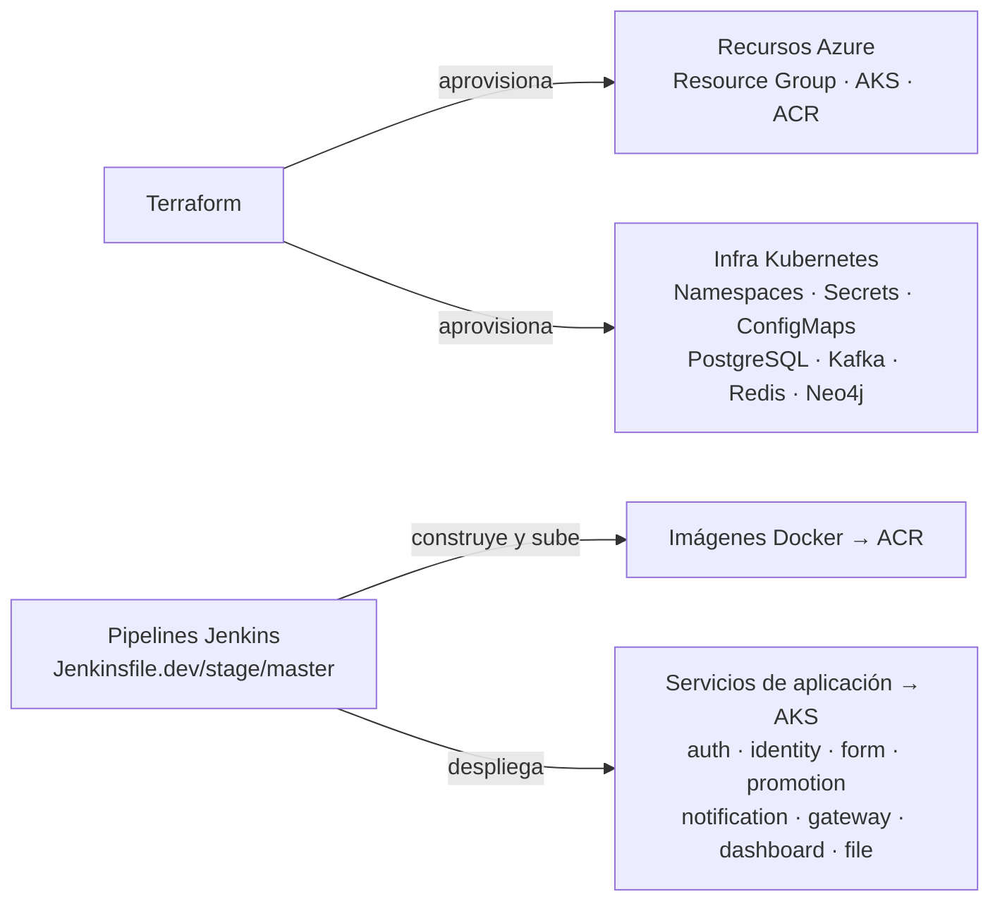

# Arquitectura de Infraestructura Terraform

> **Visualización:** Este documento utiliza diagramas [Mermaid](https://mermaid.js.org/) que se renderizan automáticamente en GitHub.
> Para exportar como PNG/SVG (presentaciones, documentos), pega cualquier bloque de diagrama en [mermaid.live](https://mermaid.live) y usa el botón de exportar.

---

## Descripción General

Terraform gestiona todos los recursos de Azure y la infraestructura de Kubernetes para CircleGuard. **No gestiona los despliegues de servicios de aplicación** — esos son responsabilidad exclusiva de los pipelines de Jenkins.

**Backend remoto:** HCP Terraform Cloud, organización `IngSoV`, workspace `circleguard-dev`.

La infraestructura se organiza en cuatro módulos reutilizables invocados desde el módulo raíz (`terraform/main.tf`):

| Módulo | Aprovisiona |
|---|---|
| `aks-cluster` | Resource Group de Azure + clúster AKS con 2 nodos |
| `acr` | Azure Container Registry + rol AcrPull para AKS |
| `k8s-namespace` | Namespaces de Kubernetes (`dev`, `stage`, `master`) |
| `k8s-infra` | Stack de infra por namespace (PostgreSQL, Kafka, Redis, Neo4j, Secrets, ConfigMap) |

---

## Grafo de Dependencias entre Módulos

Los módulos tienen una cadena de dependencias estricta: AKS debe existir antes que cualquier otro recurso. Una vez listo AKS, el registry y los namespaces se aprovisionan en paralelo. Finalmente, el stack de infra se despliega en cada namespace.

---

## Recursos de Azure

Terraform aprovisiona dos recursos de Azure dentro de un Resource Group dedicado. El clúster AKS usa una identidad administrada asignada por el sistema; su identidad de kubelet recibe permisos `AcrPull` sobre el registry para que los pods puedan descargar imágenes sin credenciales adicionales.

> **Por qué Kubernetes 1.34 está fijado:** Sin una versión explícita, Azure actualiza el clúster automáticamente durante `terraform apply`, generando una operación de 40 minutos. Fijar la versión evita actualizaciones no planificadas.

---

## Recursos de Kubernetes (por namespace)

El módulo `k8s-infra` se instancia tres veces — una por cada namespace (`dev`, `stage`, `master`). Cada namespace recibe un stack de infra idéntico e independiente.

Los cuatro componentes de infra exponen sus endpoints a través del ConfigMap `circleguard-config`, que los servicios de aplicación consumen para conectarse. Las credenciales sensibles se almacenan en el Secret `circleguard-secrets`.

---

## Límite de Responsabilidades

> Separar estas responsabilidades garantiza que los cambios de infraestructura (escalar nodos, rotar secrets) no requieren un build de Jenkins, y que los despliegues de aplicación nunca modifican el estado de la infraestructura.

---

## Variables de Entrada (HCP Terraform Cloud)

Todos los valores sensibles se almacenan como variables cifradas en HCP Terraform Cloud y nunca se commitean al repositorio.

| Variable | Descripción | Sensible |
|---|---|:---:|
| `resource_group_name` | Nombre del Resource Group de Azure | |
| `cluster_name` | Nombre del clúster AKS | |
| `acr_name` | Nombre del registry ACR | |
| `environment` | Etiqueta de entorno | |
| `postgres_user` | Usuario de PostgreSQL | |
| `postgres_password` | Contraseña de PostgreSQL | Sí |
| `neo4j_password` | Contraseña de Neo4j | Sí |
| `jwt_secret` | Secreto para firma de JWT | Sí |
| `ARM_CLIENT_ID` | ID del Service Principal de Azure | |
| `ARM_CLIENT_SECRET` | Secreto del Service Principal | Sí |
| `ARM_TENANT_ID` | ID del tenant de Azure | |
| `ARM_SUBSCRIPTION_ID` | ID de la suscripción de Azure | |
